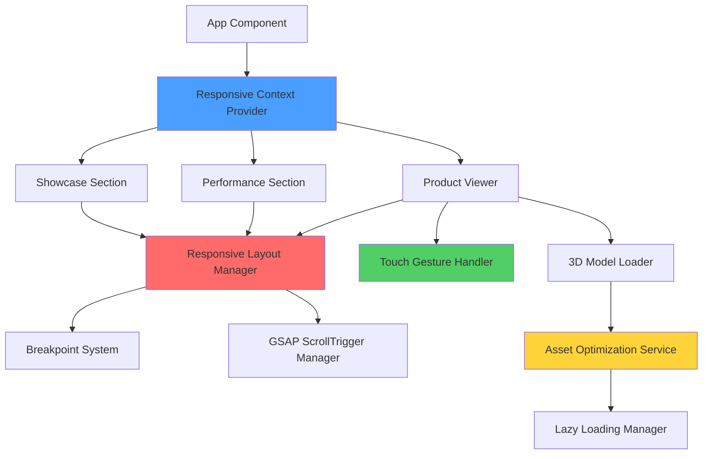

# Design Document

## Overview

This design addresses responsive layout issues and mobile optimization for the my-project website. The solution focuses on three key areas:

1. **Responsive Layout Fixes** - Implementing fluid layouts with container queries and improved breakpoint handling for Showcase and Performance sections
2. **Mobile Touch Interactions** - Adding native touch gesture support to the Product Viewer's 3D Canvas
3. **Performance Optimization** - Implementing lazy loading, asset optimization, and conditional rendering strategies for mobile devices

The design leverages existing technologies (GSAP, React Three Fiber, react-responsive) while introducing new patterns for better responsive behavior and mobile performance.

## Architecture

### High-Level Architecture



### Component Hierarchy

```
App
├── ResponsiveProvider (new)
│   ├── useBreakpoint hook
│   └── useViewportResize hook
├── Showcase
│   ├── ResponsiveVideoBackground
│   ├── ResponsiveMask
│   └── ResponsiveContent
├── Performance
│   ├── ResponsiveImageGrid
│   └── AdaptiveScrollAnimations
└── ProductViewer
    ├── TouchGestureCanvas (enhanced)
    ├── OptimizedModelLoader (new)
    └── PerformanceMonitor (new)
```

## Components and Interfaces

### 1. Responsive Context System

**Purpose:** Centralize breakpoint management and viewport state across all components.

**Interface:**
```typescript
// src/contexts/ResponsiveContext.tsx
interface ResponsiveContextValue {
  breakpoint: 'mobile' | 'tablet' | 'desktop' | 'wide';
  isMobile: boolean;
  isTablet: boolean;
  isDesktop: boolean;
  viewport: {
    width: number;
    height: number;
    aspectRatio: number;
  };
  orientation: 'portrait' | 'landscape';
}

interface BreakpointConfig {
  mobile: number;    // 0-767px
  tablet: number;    // 768-1023px
  desktop: number;   // 1024-1439px
  wide: number;      // 1440px+
}

const BREAKPOINTS: BreakpointConfig = {
  mobile: 767,
  tablet: 1023,
  desktop: 1439,
  wide: Infinity
};
```

**Implementation Strategy:**
- Create a React Context that provides viewport information
- Use ResizeObserver for efficient viewport tracking
- Debounce resize events (150ms) to prevent excessive re-renders
- Sync with react-responsive for backward compatibility

### 2. Enhanced Showcase Component

**Current Issues:**
- Content overlaps at intermediate viewport sizes (900-1100px)
- GSAP animations don't recalculate on resize
- Fixed padding causes text overflow on tablets

**Design Solution:**

```typescript
// src/components/Showcase/ResponsiveShowcase.tsx
interface ShowcaseLayoutConfig {
  containerPadding: string;
  contentMaxWidth: string;
  statsMaxWidth: string;
  contentGap: string;
  videoAspectRatio: string;
  maskScale: number;
}

const getLayoutConfig = (breakpoint: string): ShowcaseLayoutConfig => {
  // Returns fluid configuration based on breakpoint
  // Uses CSS clamp() for smooth scaling between breakpoints
};
```

**Layout Strategy:**
- Use CSS Grid with `grid-template-areas` for flexible content positioning
- Implement `container-queries` for self-contained responsive behavior
- Add `min-height` constraints to prevent collapse
- Use `clamp()` for fluid typography and spacing

**GSAP Animation Improvements:**
```typescript
useGSAP(() => {
  const mm = gsap.matchMedia();
  
  mm.add({
    isMobile: "(max-width: 767px)",
    isTablet: "(min-width: 768px) and (max-width: 1023px)",
    isDesktop: "(min-width: 1024px)"
  }, (context) => {
    const { isMobile, isTablet, isDesktop } = context.conditions;
    
    // Conditional animations based on media query
    if (isDesktop) {
      // Full animation timeline
    } else if (isTablet) {
      // Simplified animations
    } else {
      // Minimal or no animations
    }
  });
  
  return () => mm.revert(); // Cleanup
}, { dependencies: [breakpoint], revertOnUpdate: true });
```

### 3. Enhanced Performance Component

**Current Issues:**
- Absolute positioned images overlap at specific aspect ratios
- Image positioning doesn't interpolate smoothly between breakpoints
- Mobile layout still uses absolute positioning causing issues

**Design Solution:**

**Responsive Image Positioning System:**
```typescript
// src/utils/responsiveImagePositioning.ts
interface ImagePosition {
  id: string;
  position: {
    mobile: PositionConfig;
    tablet: PositionConfig;
    desktop: PositionConfig;
    wide: PositionConfig;
  };
}

interface PositionConfig {
  layout: 'absolute' | 'grid' | 'stack';
  left?: string;
  right?: string;
  top?: string;
  bottom?: string;
  transform?: string;
  gridArea?: string;
  zIndex?: number;
}

// Interpolation function for smooth transitions
const interpolatePosition = (
  currentWidth: number,
  breakpointA: number,
  breakpointB: number,
  configA: PositionConfig,
  configB: PositionConfig
): PositionConfig => {
  // Linear interpolation between two breakpoint configurations
};
```

**Layout Modes:**
- **Desktop (1024px+):** Absolute positioning with GSAP animations
- **Tablet (768-1023px):** Hybrid grid/absolute with reduced animations
- **Mobile (<768px):** CSS Grid stack layout, no absolute positioning

**Container Strategy:**
```css
.images-viewport {
  container-type: inline-size;
  container-name: performance-images;
}

@container performance-images (max-width: 767px) {
  .wrapper {
    display: grid;
    grid-template-columns: 1fr;
    gap: 1rem;
  }
  
  img {
    position: relative !important;
    max-width: 100%;
  }
}
```

### 4. Touch-Enabled Product Viewer

**Current Issues:**
- No touch gesture support for 3D model rotation
- Canvas blocks scroll on mobile
- No visual feedback for interactions

**Design Solution:**

**Touch Gesture Handler:**
```typescript
// src/components/ProductViewer/TouchGestureHandler.tsx
interface TouchGestureState {
  isActive: boolean;
  startPosition: { x: number; y: number };
  currentPosition: { x: number; y: number };
  velocity: { x: number; y: number };
  scale: number;
  rotation: { x: number; y: number };
}

interface GestureConfig {
  enableRotation: boolean;
  enableZoom: boolean;
  enablePan: boolean;
  rotationSpeed: number;
  zoomSpeed: number;
  dampingFactor: number;
  minZoom: number;
  maxZoom: number;
}

const useTouchGestures = (
  canvasRef: RefObject<HTMLCanvasElement>,
  config: GestureConfig
) => {
  // Returns gesture state and handlers
};
```

**Implementation Strategy:**
- Use native touch events (touchstart, touchmove, touchend)
- Implement pinch-to-zoom with two-finger detection
- Add momentum/inertia for natural feel
- Prevent default scroll only when canvas is touched
- Add visual ripple effect on touch

**OrbitControls Configuration:**
```typescript
<OrbitControls
  enableZoom={!isMobile}
  enablePan={false}
  enableDamping={true}
  dampingFactor={0.05}
  rotateSpeed={isMobile ? 0.8 : 0.5}
  minDistance={isMobile ? 3 : 2}
  maxDistance={isMobile ? 8 : 10}
  touches={{
    ONE: THREE.TOUCH.ROTATE,
    TWO: THREE.TOUCH.DOLLY_PAN
  }}
/>
```

### 5. Performance Optimization System

**Asset Optimization Service:**
```typescript
// src/services/AssetOptimizationService.ts
interface AssetConfig {
  type: 'video' | 'image' | 'model';
  desktop: string;
  mobile?: string;
  quality: 'high' | 'medium' | 'low';
  lazy: boolean;
}

class AssetOptimizationService {
  static getOptimizedAsset(
    config: AssetConfig,
    deviceType: string,
    connection: NetworkInformation
  ): string {
    // Returns appropriate asset based on device and connection
  }
  
  static preloadCritical(assets: string[]): Promise<void> {
    // Preloads critical assets
  }
  
  static lazyLoadNonCritical(assets: string[]): void {
    // Lazy loads non-critical assets
  }
}
```

**Optimization Strategies:**

1. **Video Optimization:**
   - Desktop: 1080p MP4 (H.264)
   - Mobile: 720p MP4 with lower bitrate
   - Use `preload="metadata"` on mobile
   - Implement poster images for initial load

2. **3D Model Optimization:**
   - Create LOD (Level of Detail) versions
   - Desktop: High-poly model (current)
   - Mobile: Low-poly model (50% reduction)
   - Use Draco compression for GLTF models
   - Progressive loading with placeholder

3. **Image Optimization:**
   - Serve WebP with JPEG fallback
   - Use `srcset` for responsive images
   - Implement lazy loading with Intersection Observer
   - Add blur-up placeholder technique

4. **Code Splitting:**
   ```typescript
   // Lazy load heavy components
   const ProductViewer = lazy(() => import('./components/ProductViewer'));
   const Performance = lazy(() => import('./components/Performance'));
   
   // Conditional GSAP plugin loading
   if (isDesktop) {
     await import('gsap/ScrollTrigger');
   }
   ```

### 6. Lazy Loading Manager

**Purpose:** Intelligently load content based on viewport visibility and device capabilities.

```typescript
// src/hooks/useLazyLoad.ts
interface LazyLoadConfig {
  threshold: number;
  rootMargin: string;
  triggerOnce: boolean;
}

const useLazyLoad = (
  ref: RefObject<HTMLElement>,
  config: LazyLoadConfig
) => {
  const [isVisible, setIsVisible] = useState(false);
  const [hasLoaded, setHasLoaded] = useState(false);
  
  // Returns visibility state and load trigger
};
```

**Implementation:**
- Use Intersection Observer API
- Load Performance section images when 20% visible
- Load Product Viewer 3D model when section is 50% visible
- Preload next section when current section is 80% scrolled

### 7. Performance Monitor

**Purpose:** Track and optimize runtime performance on mobile devices.

```typescript
// src/utils/PerformanceMonitor.ts
interface PerformanceMetrics {
  fps: number;
  memory: number;
  loadTime: number;
  interactionDelay: number;
}

class PerformanceMonitor {
  static measureFPS(): number;
  static detectLowEndDevice(): boolean;
  static adaptQuality(metrics: PerformanceMetrics): QualitySettings;
}

interface QualitySettings {
  enableAnimations: boolean;
  modelQuality: 'high' | 'medium' | 'low';
  textureResolution: number;
  shadowQuality: 'high' | 'low' | 'none';
}
```

**Adaptive Quality Strategy:**
- Monitor FPS during initial render
- If FPS < 30, reduce quality settings
- Disable shadows on low-end devices
- Reduce texture resolution
- Simplify or disable GSAP animations

## Data Models

### Breakpoint Configuration Model
```typescript
interface BreakpointSystem {
  breakpoints: BreakpointConfig;
  queries: MediaQueryConfig;
  spacing: SpacingScale;
  typography: TypographyScale;
}

interface SpacingScale {
  mobile: { [key: string]: string };
  tablet: { [key: string]: string };
  desktop: { [key: string]: string };
}
```

### Asset Configuration Model
```typescript
interface AssetManifest {
  videos: {
    [key: string]: {
      desktop: string;
      mobile: string;
      poster: string;
    };
  };
  models: {
    [key: string]: {
      high: string;
      low: string;
      placeholder: string;
    };
  };
  images: {
    [key: string]: {
      srcSet: string[];
      sizes: string;
      alt: string;
    };
  };
}
```

## Error Handling

### Responsive Layout Errors
- **Issue:** GSAP animations fail on resize
- **Solution:** Wrap animations in try-catch, implement fallback static layout
- **Recovery:** Disable animations, show content without transitions

### Touch Gesture Errors
- **Issue:** Touch events conflict with scroll
- **Solution:** Use passive event listeners, selective preventDefault
- **Recovery:** Fall back to OrbitControls default behavior

### Asset Loading Errors
- **Issue:** 3D model fails to load on mobile
- **Solution:** Implement retry logic with exponential backoff
- **Recovery:** Show 2D fallback image with product information

### Performance Degradation
- **Issue:** FPS drops below 30 on low-end devices
- **Solution:** Automatically reduce quality settings
- **Recovery:** Disable 3D viewer, show static images

## Testing Strategy

### Responsive Layout Testing
1. **Manual Testing:**
   - Test at standard breakpoints: 375px, 768px, 1024px, 1440px, 1920px
   - Test intermediate sizes: 900px, 1100px, 1200px
   - Test landscape mobile orientation
   - Test browser zoom levels (100%, 125%, 150%)

2. **Automated Testing:**
   - Visual regression tests with Playwright
   - Screenshot comparison at multiple viewports
   - Layout shift detection (CLS metric)

### Touch Gesture Testing
1. **Device Testing:**
   - iOS Safari (iPhone 12, 13, 14)
   - Android Chrome (various devices)
   - iPad Safari (tablet gestures)

2. **Gesture Scenarios:**
   - Single finger rotation
   - Two finger pinch zoom
   - Rapid swipe with momentum
   - Simultaneous touch and scroll

### Performance Testing
1. **Metrics to Track:**
   - First Contentful Paint (FCP) < 1.5s
   - Largest Contentful Paint (LCP) < 2.5s
   - Time to Interactive (TTI) < 3.5s
   - Cumulative Layout Shift (CLS) < 0.1
   - First Input Delay (FID) < 100ms

2. **Testing Tools:**
   - Lighthouse (mobile simulation)
   - WebPageTest (real device testing)
   - Chrome DevTools Performance panel
   - React DevTools Profiler

3. **Test Scenarios:**
   - 3G connection simulation
   - CPU throttling (4x slowdown)
   - Low-end device simulation
   - Memory constraints

### Cross-Browser Testing
- Chrome/Edge (Chromium)
- Safari (WebKit)
- Firefox (Gecko)
- Mobile browsers (iOS Safari, Chrome Mobile)

## Implementation Notes

### CSS Strategy
- Use CSS Grid for major layout structure
- Use Flexbox for component-level alignment
- Implement CSS Container Queries for self-contained responsiveness
- Use CSS custom properties for dynamic theming
- Leverage `clamp()` for fluid typography and spacing

### GSAP Best Practices
- Always use `invalidateOnRefresh: true` for ScrollTrigger
- Implement `gsap.matchMedia()` for responsive animations
- Clean up timelines on component unmount
- Use `revertOnUpdate` for dynamic dependencies
- Batch DOM reads/writes to prevent layout thrashing

### React Three Fiber Optimization
- Use `<Suspense>` with fallback for model loading
- Implement `useFrame` throttling on mobile
- Reduce `pixelRatio` on mobile devices
- Use `<Preload>` for critical assets
- Implement frustum culling for off-screen objects

### Mobile-First Approach
- Start with mobile styles as base
- Progressive enhancement for larger screens
- Touch targets minimum 44x44px
- Avoid hover-dependent interactions
- Ensure text remains readable (min 16px)

## Dependencies

### New Dependencies
None required - all solutions use existing dependencies:
- `gsap` (already installed)
- `@react-three/fiber` (already installed)
- `@react-three/drei` (already installed)
- `react-responsive` (already installed)

### Browser APIs Used
- ResizeObserver (viewport tracking)
- IntersectionObserver (lazy loading)
- Touch Events API (gesture handling)
- Network Information API (connection detection)
- Performance API (metrics tracking)

## Migration Strategy

### Phase 1: Responsive Context Setup
1. Create ResponsiveProvider
2. Wrap App with provider
3. Update existing components to use context

### Phase 2: Showcase Fixes
1. Refactor Showcase layout to CSS Grid
2. Update GSAP animations with matchMedia
3. Test at all breakpoints

### Phase 3: Performance Fixes
1. Implement responsive image positioning
2. Add container queries
3. Update GSAP ScrollTrigger configuration

### Phase 4: Touch Gestures
1. Add touch event handlers to Canvas
2. Configure OrbitControls for mobile
3. Test on real devices

### Phase 5: Performance Optimization
1. Implement lazy loading
2. Add asset optimization
3. Create LOD models
4. Optimize videos

### Phase 6: Testing & Refinement
1. Cross-browser testing
2. Performance audits
3. User testing
4. Bug fixes and polish
