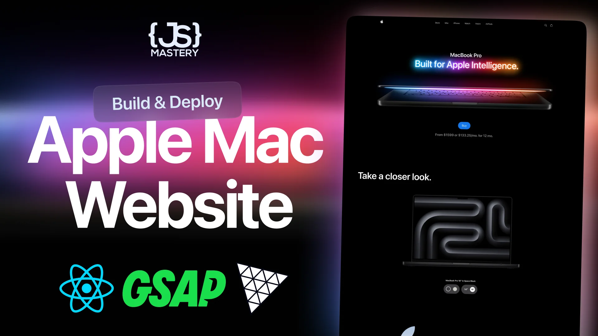
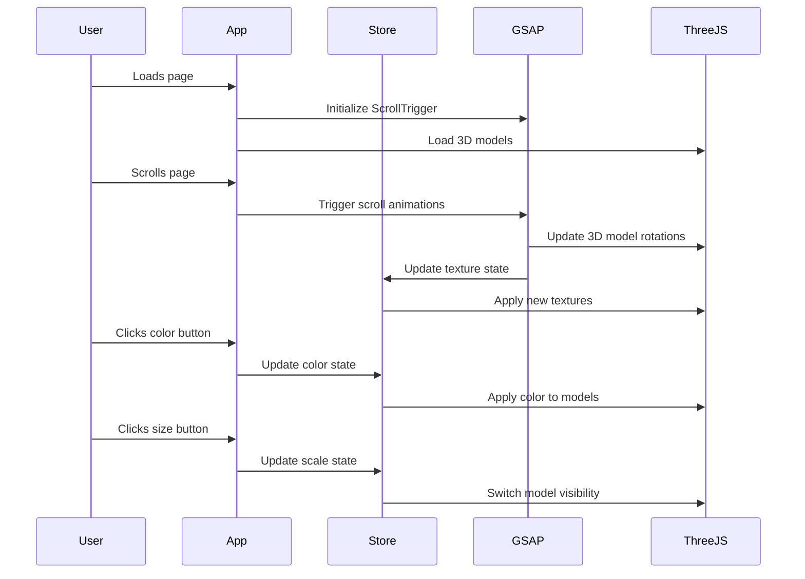
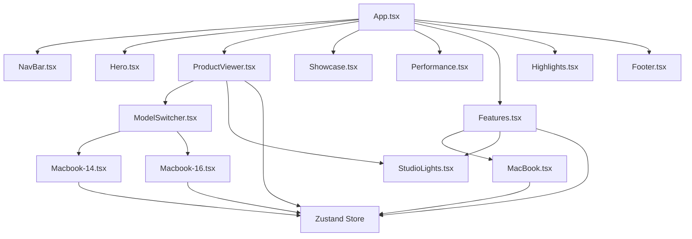
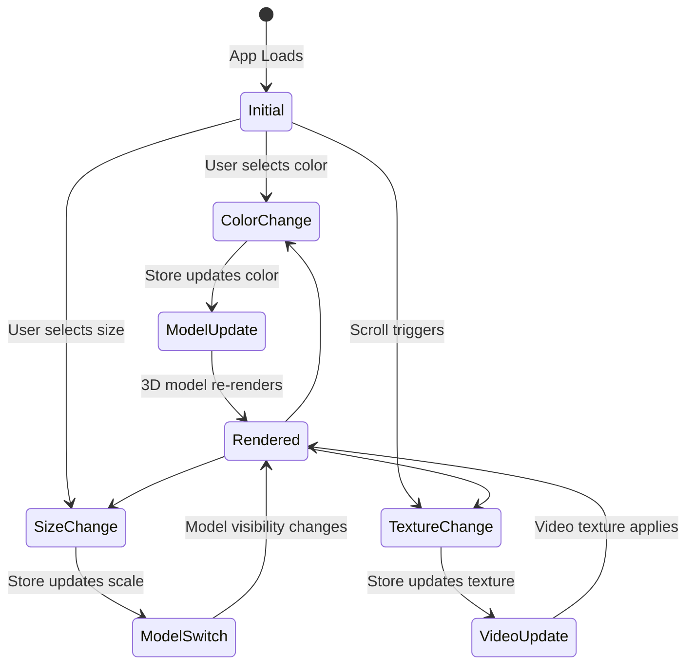

# MacBook Pro Landing Page

A modern, interactive MacBook Pro landing page built with React, TypeScript, Three.js, and GSAP animations. This project showcases advanced web development techniques including 3D model rendering, scroll-triggered animations, and responsive design.



## 🚀 Features

- **Interactive 3D Models**: Real-time MacBook Pro models with color customization
- **Scroll-Triggered Animations**: Smooth GSAP animations synchronized with scroll
- **Responsive Design**: Optimized for desktop, tablet, and mobile devices
- **Video Textures**: Dynamic video mapping on 3D models
- **State Management**: Zustand for efficient state handling
- **Performance Optimized**: Lazy loading and efficient rendering

## 🛠️ Tech Stack

- **Frontend Framework**: React 19.1.1 with TypeScript
- **3D Graphics**: Three.js with React Three Fiber & Drei
- **Animations**: GSAP (GreenSock Animation Platform)
- **State Management**: Zustand
- **Styling**: Tailwind CSS with custom PostCSS
- **Build Tool**: Vite
- **Development**: ESLint, TypeScript, React Compiler

## 📦 Installation

1. **Clone the repository**
   ```bash
   git clone <repository-url>
   cd practise/practise
   ```

2. **Install dependencies**
   ```bash
   npm install
   ```

3. **Start development server**
   ```bash
   npm run dev
   ```

4. **Build for production**
   ```bash
   npm run build
   ```

5. **Preview production build**
   ```bash
   npm run preview
   ```

## 🏗️ Project Structure

```
my-project/
├── public/
│   ├── fonts/           # Custom font files
│   ├── models/          # 3D GLTF models
│   ├── videos/          # Video assets for textures
│   └── *.png, *.svg     # Static images and icons
├── src/
│   ├── components/
│   │   ├── models/      # 3D model components
│   │   ├── three/       # Three.js specific components
│   │   └── *.tsx        # React components
│   ├── constants/       # Application constants
│   ├── store/           # Zustand state management
│   ├── App.tsx          # Main application component
│   └── main.tsx         # Application entry point
└── package.json
```

## 🎯 Component Architecture

### Core Components

#### 1. **App.tsx** - Main Application
- Orchestrates all page sections
- Registers GSAP plugins (ScrollTrigger, SplitText)
- Renders complete landing page structure

#### 2. **NavBar.tsx** - Navigation Header
- Apple-style navigation with logo and menu items
- Search and cart functionality
- Responsive design with mobile considerations

#### 3. **Hero.tsx** - Landing Section
- MacBook opening animation
- Promotional title and pricing
- Call-to-action button

#### 4. **ProductViewer.tsx** - Interactive 3D Showcase
- 3D MacBook models with orbit controls
- Color and size selection (14" vs 16")
- Real-time model switching with animations

#### 5. **Showcase.tsx** - Video Background Section
- Masked logo with scroll-triggered scaling
- M4 chip promotional content
- Performance statistics display

#### 6. **Performance.tsx** - Graphics Performance
- Animated image positioning with GSAP
- Responsive layout with golden ratio positioning
- M4 chip graphics capabilities showcase

#### 7. **Features.tsx** - Interactive Feature Demo
- Rotating 3D MacBook with synchronized content
- Video texture mapping for feature demonstrations
- Scroll-synchronized animations

#### 8. **Highlights.tsx** - Feature Grid
- Masonry-style layout
- Staggered animations
- Key MacBook Pro benefits

#### 9. **Footer.tsx** - Site Footer
- Company information and legal links
- Dynamic link rendering from constants

### 3D Components

#### **ModelSwitcher.tsx**
- Handles transitions between 14" and 16" models
- GSAP-powered fade and position animations
- PresentationControls integration

#### **StudioLights.tsx**
- Professional lighting setup for 3D scenes
- Environment mapping and spotlight configuration
- Ambient and directional lighting

#### **MacBook Models**
- **Macbook-14.tsx**: 14-inch model with color customization
- **Macbook-16.tsx**: 16-inch model with color customization  
- **Macbook.tsx**: Feature demo model with video textures

## 🔄 Application Flow & Sequence Diagrams

### User Interaction Flow



### Component Lifecycle



### State Management Flow



## 🎨 Animation System

### GSAP Integration

The project uses GSAP for sophisticated animations:

1. **Scroll-Triggered Animations**
   - Hero video scaling
   - Model rotations in Features section
   - Performance image positioning
   - Text reveals and transitions

2. **Timeline Synchronization**
   - Video texture changes sync with scroll
   - Content boxes appear with model rotation
   - Staggered element animations

3. **Responsive Animations**
   - Different animation parameters for mobile/tablet
   - Conditional animation execution based on screen size

### Three.js Rendering

1. **Model Loading**
   - GLTF models loaded with useGLTF hook
   - Preloading for performance optimization
   - Material and texture management

2. **Interactive Controls**
   - PresentationControls for user interaction
   - OrbitControls for detailed viewing
   - Smooth camera transitions

3. **Dynamic Materials**
   - Real-time color changes
   - Video texture mapping
   - Material property animations

## 🎯 Key Features Walkthrough

### 1. Product Viewer Section
**Purpose**: Interactive 3D MacBook showcase with customization options

**Flow**:
1. User lands on ProductViewer section
2. 3D MacBook model loads with default settings (16", Space Gray)
3. User can interact with color buttons (Silver/Space Gray)
4. User can switch between 14" and 16" models
5. ModelSwitcher handles smooth transitions between models
6. Store updates trigger re-renders with new properties

**Technical Implementation**:
- Zustand store manages `color`, `scale` states
- ModelSwitcher uses GSAP for fade/position animations
- Three.js materials update in real-time
- PresentationControls enable user interaction

### 2. Features Section
**Purpose**: Demonstrate MacBook features through interactive 3D model

**Flow**:
1. User scrolls to Features section
2. 3D MacBook begins rotating (360° over scroll distance)
3. As model rotates, different feature videos map to screen
4. Feature description boxes appear synchronized with rotation
5. Each feature (Email AI, Image AI, etc.) highlights at specific rotation points

**Technical Implementation**:
- GSAP ScrollTrigger controls model rotation
- Timeline synchronizes video textures with scroll position
- useVideoTexture hook manages video playback
- Feature boxes animate with opacity and position changes

### 3. Performance Section
**Purpose**: Showcase M4 chip graphics performance with dynamic layout

**Flow**:
1. User scrolls to Performance section
2. Images animate from initial positions to final layout
3. Text content reveals with scroll-triggered animations
4. Responsive positioning based on screen size

**Technical Implementation**:
- Golden ratio-based positioning system
- GSAP timeline manages image positioning
- Responsive configurations for different screen sizes
- ScrollTrigger manages animation timing

## 🔧 State Management

### Zustand Store Structure

```typescript
interface MacbookState {
  color: string;        // Current MacBook color
  setColor: (color: string) => void;
  scale: number;        // Model scale (0.06 for 14", 0.08 for 16")
  setScale: (scale: number) => void;
  texture: string;      // Current video texture path
  setTexture: (texture: string) => void;
  reset: () => void;    // Reset to defaults
}
```

### State Flow
1. **Color Changes**: User clicks color button → Store updates → All models re-render
2. **Size Changes**: User clicks size button → Store updates → ModelSwitcher animates transition
3. **Texture Changes**: Scroll triggers → Store updates → Video texture applies to model

## 🎨 Styling & Design

### Tailwind CSS Integration
- Custom color palette matching Apple's design language
- Responsive utilities for mobile-first design
- Custom animations and transitions

### Typography
- Custom font family loaded from `/public/fonts/`
- Hierarchical text sizing and spacing
- Apple-inspired typography scale

### Layout Patterns
- Flexbox and Grid for responsive layouts
- Absolute positioning for overlay elements
- Z-index management for layered content

## 🚀 Performance Optimizations

### 3D Model Optimization
- GLTF models compressed and optimized
- Model preloading with `useGLTF.preload()`
- Efficient material updates without full re-renders

### Animation Performance
- GSAP's optimized rendering pipeline
- RequestAnimationFrame-based animations
- Conditional animations based on device capabilities

### Asset Loading
- Lazy loading of video textures
- Image optimization and compression
- Font preloading for typography

## 📱 Responsive Design

### Breakpoint Strategy
- Mobile: `max-width: 768px`
- Tablet: `max-width: 1024px`
- Desktop: `min-width: 1025px`

### Adaptive Features
- Scaled 3D models for smaller screens
- Simplified animations on mobile
- Touch-optimized interactions
- Responsive image positioning

## 🧪 Development Guidelines

### Code Organization
- Component-based architecture
- Separation of concerns (3D, UI, animations)
- TypeScript for type safety
- ESLint for code quality

### Performance Monitoring
- React DevTools for component analysis
- Three.js Inspector for 3D debugging
- GSAP DevTools for animation debugging

### Best Practices
- Cleanup of event listeners and animations
- Memory management for 3D resources
- Error boundaries for robust user experience

## 🔮 Future Enhancements

- [ ] WebXR support for AR/VR experiences
- [ ] Advanced physics simulations
- [ ] Real-time ray tracing effects
- [ ] Progressive Web App features
- [ ] Accessibility improvements
- [ ] Performance analytics integration

## 📄 License

This project is for educational and demonstration purposes.

## 🤝 Contributing

1. Fork the repository
2. Create a feature branch
3. Commit your changes
4. Push to the branch
5. Create a Pull Request

---

**Built with ❤️ by Alex Cou**